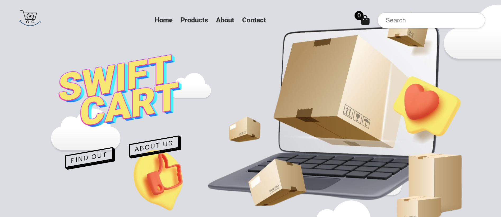

# 🛒 E-SwiftCart - An E-Commerce Platform

Welcome to E-SwiftCart, a modern and responsive e-commerce platform built with ReactJS, CSS, and Bootstrap. This project utilizes an API for calling products, providing a seamless shopping experience for users.

## Table of Contents
- [Introduction](#introduction)
- [Technologies](#technologies)
- [Features](#features)
- [Installation](#installation)
- [Usage](#usage)
- [Contributing](#contributing)
- [License](#license)

## Introduction

E-SwiftCart is an e-commerce platform designed to simplify online shopping. Leveraging the power of ReactJS, CSS, and Bootstrap, this project delivers a visually appealing and user-friendly interface. The integration of an external API ensures a dynamic product catalog, providing users with an extensive range of products.

## Technologies

🧠 **ReactJS**
🎨 **CSS**
🖌️ **Bootstrap**

## Features

- **Dynamic Product Catalog**: Utilizes an external API to fetch and display a diverse range of products.
- **Responsive Design**: Ensures a seamless experience across various devices with the help of Bootstrap.
- **User-Friendly Interface**: A clean and intuitive UI for easy navigation and enhanced user experience.

## Installation

1. Clone the repository: `git clone https://github.com/GasparBonari/e-swiftcart`
2. Navigate to the project directory: `cd e-swiftcart`
3. Install dependencies: `npm install`

## Usage

1. Start the development server: `npm run dev`
2. Open your browser and go to [http://localhost:3000](http://localhost:3000)

Feel free to explore the application, browse products, and experience the seamless shopping journey.

## Contributing

Contributions are welcome! If you'd like to contribute to the project, please follow these steps:

1. Fork the repository.
2. Create a new branch: `git checkout -b feature/new-feature`
3. Make your changes and commit them: `git commit -m 'Add new feature'`
4. Push to the branch: `git push origin feature/new-feature`
5. Submit a pull request.

## License

This project is licensed under the MIT License - see the [LICENSE](LICENSE) file for details.

---

Thank you for checking out E-SwiftCart! If you have any questions or suggestions, feel free to open an issue or contact us. Happy shopping!
